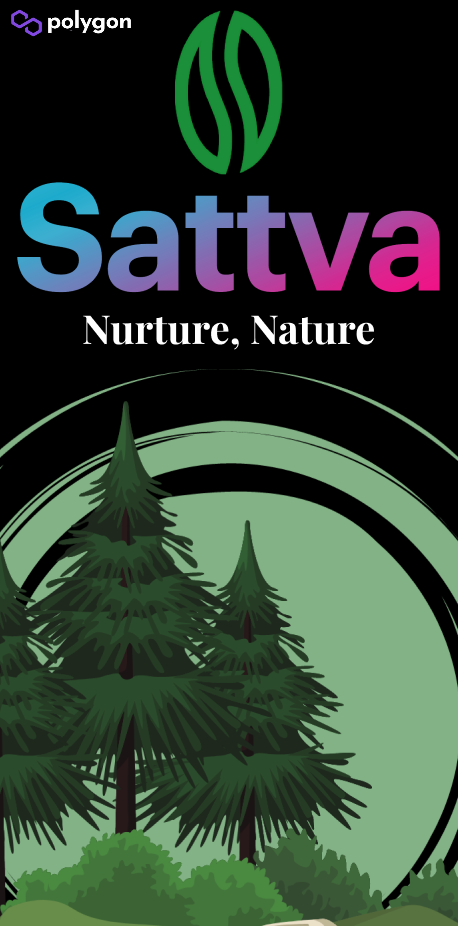
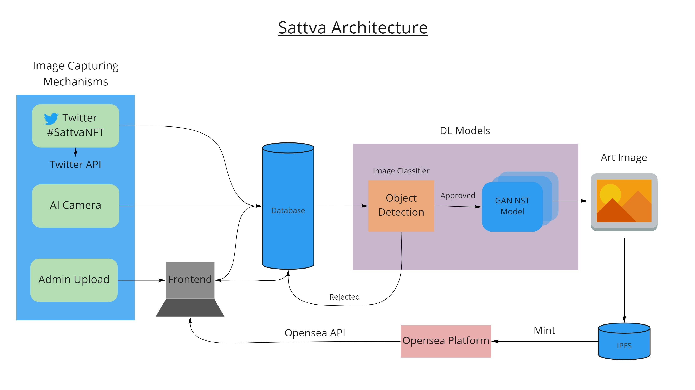
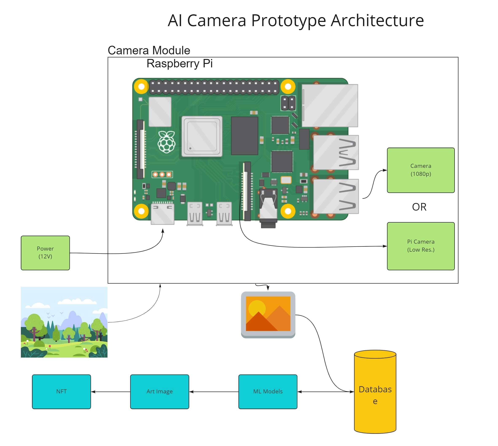
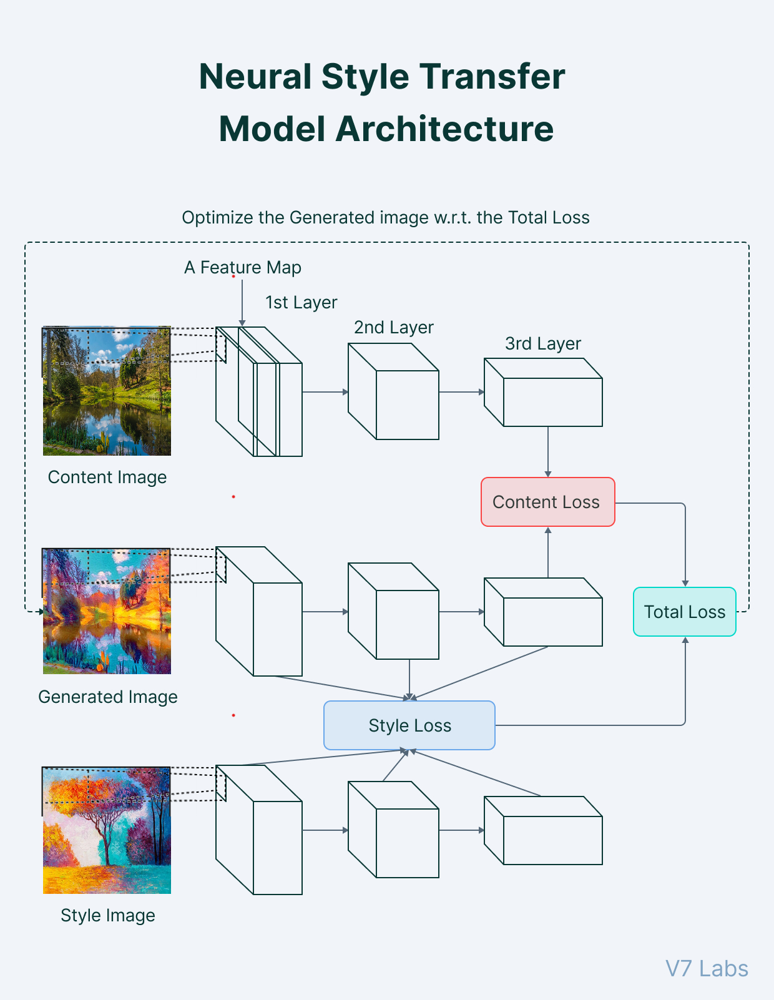

# Sattva_Curl_2022
<p align="center">
  
</p>

<hr>

Sattva is a end-to-end platform that focuses on capturing and harnessing the value that a park generates. It converts images created or owned by the park into attractive artworks automatically. We make them unique by utilizing an object detection model and integrating creative styles with nature photographs using neural style transfer algorithms. As a result, no two photographs are ever the same. These artworks are turned into Non Fungible Tokens (NFTs) and sold on Opensea on behalf of the park.

<hr>

### Installation and Running Instructions - Windows

#### Method 1 - Manually Typing Instructions In Terminal

To run the project on Windows by manually typing the commands one by one, do the following - 

* Get a copy of this project locally and install the dependencies

  1. Fork this repository.

  2. `git clone <url>` - put the url of your forked repo. Once you have the cloned copy locally. `cd` into the project folder.

  3. Create a virtual environment inside the project folder using the following:

     ```shell
     python -m venv venv
     ```

  4. Activate the virtual environment using:

     ```shell
     .\venv\Scripts\activate
     ```

  5. Now Install React dependencies by the following:

     ```shell
     cd frontend\
     npm i
     ```
     ```shell
     cd frontend\dashboard2\
     npm i
     ```

  6. Once the environment is activated, install the dependencies using:

     ```
     Starting from the root folder
     cd backend\
     pip install -r requirements.txt
     ```

* Once all dependencies are installed go to the project root folder and run the following commands:

  1. Activate the virtual environment if not done so:

     ```shell
     .\venv\Scripts\activate
     ```

  2. Start the Database server - By running MongoDB Community Edition. (Can be downloaded from their website)

  3. Start the Backend server (From the root folder)

     ```shell
     cd backend
     python app.py
     ```

  4. Start the Frontend server (From the root folder - can be done by opening a new terminal window)

     ```shell
     cd frontend\dashboard2\
     npm start
     ```
     
  5. Start the twitter Api Server (From the root folder - can be done by opening a new terminal window)
     ```shell
     cd backend\
     python twitter_api.py
     ```
  6. Start the AI Camera (From the root folder - can be done by opening a new terminal window)
    ```shell
     cd backend\
     python ai_camera.py
     ```
  
* Go to `localhost:3000/` and access Sattva Frontend !

# Architecture of Sattva <a id='BLOCKS'></a>

## Data Flow Architecture of Sattva
<p align="center">
  
</p>

## AI Camera Prototype Architecture
<p align="center">
  
</p>

## Neural Style Transfer Model Architecture
<p align="center">
  
</p>

## NST Generated Images
<p align="center">
  
</p>

